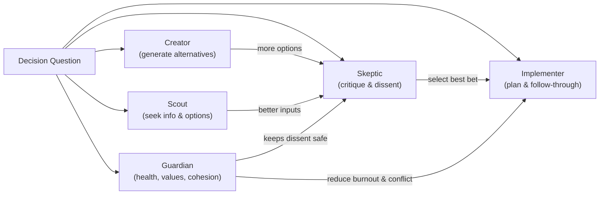
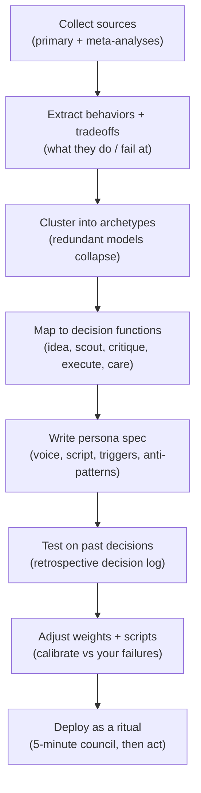

# Evidence-Based Team-Role Psychology for a Five-Seat Decision Council

## Executive Summary

A five-seat "decision council" can be grounded in evidence by treating each seat as a decision function that repeatedly appears across multiple research traditions: (1) generating alternatives, (2) scouting information/opportunities, (3) critically evaluating options (structured dissent), (4) converting a choice into an executable plan, and (5) protecting relationships/energy so decisions remain sustainable. These functions show up explicitly in behavioral role models like Belbin's framework, classic small-group role taxonomies, and trait-based research on team composition using the Big Five.

Across the major models:

- **Belbin** provides the most role-like descriptions (strengths + "allowable weaknesses") and is convenient for writing vivid advisor personas, but its measurement instruments have a mixed psychometric record in the academic literature, so it should be treated as a developmental behavioral lens, not a hard diagnostic.

- **The Big Five** has the strongest cumulative psychometric evidence base and is the best "ground truth" for anchoring which behavioral tendencies predict performance and coordination in teams (especially conscientiousness and agreeableness, with openness often relevant to creativity/problem-solving depending on task context).

- **MBTI** is widely used for team development and provides a shared vocabulary for differences in information-gathering and decision preferences, but it is not validated for predicting performance and has long-standing critiques around typological (binary) classification and workplace overreach; it's best used as optional flavor rather than the backbone of an evidence-grounded council.

**Recommendation (5 seats):** Build the council around five cross-validated archetypes that map cleanly to decision functions and are supported by both role models (Belbin / classic group roles) and trait research (Big Five): **Creator, Scout, Skeptic, Implementer, Guardian**. This selection is specifically designed to mitigate common decision failures: groupthink/overconvergence, informational blind spots, overconfidence, and intention-action gaps.

---

## Research Framing and Method

This report treats "team-role psychology" as three partially overlapping research streams:

1. **Behavioral role models** used in organizations for team development (e.g., Belbin), which describe recurring patterns of contribution and interaction (useful for persona-writing), but may rely on instruments whose psychometric properties are debated.
2. **Trait models** (Big Five / Five-Factor Model), which are not "roles" per se but offer the strongest evidence base for stable individual differences and how aggregated traits relate to performance in work settings and teams (useful for grounding).
3. **Classic small-group role taxonomies** and interaction analysis (task vs socioemotional behavior; task/maintenance/individual roles), which identify functions that groups must perform and the behaviors by which those functions appear (useful for mapping decision functions).

Evidence is weighted roughly as: **(highest)** meta-analyses & broad trait research > peer-reviewed role-model evaluations > official practitioner sources > non-peer-reviewed summaries (used sparingly and mostly for definitions).

---

## Major Team-Role Models and Evidence

### Belbin Role Framework (Behavioral Team Roles)

Belbin defines a team role as a behavioral tendency -- how someone behaves, contributes, and relates within a team -- often grouped into action-, people-, and cerebral-oriented categories in practitioner summaries.

The distinctive feature is the explicit pairing of strengths with "allowable weaknesses" (a weakness the team can tolerate because it is the flip-side of a contributing strength).

#### Belbin Roles: Core Behaviors, Strengths, and Allowable Weaknesses

| Role | Core Behaviors | Strengths | Allowable Weaknesses |
|------|---------------|-----------|---------------------|
| **Resource Investigator** | Explores opportunities; brings back external ideas/contacts | Outgoing, enthusiastic; develops contacts | Over-optimistic; may lose interest after initial enthusiasm; may not follow up |
| **Teamworker** | Helps team "gel"; averts friction; supports others | Cooperative, perceptive, diplomatic | Indecisive in crunch; avoids confrontation; hesitant on unpopular decisions |
| **Co-ordinator** | Clarifies goals; delegates; draws out others | Mature, confident; identifies talent | Can be seen as manipulative; may over-delegate/offload |
| **Plant** | Generates novel ideas; unconventional problem-solving | Creative, imaginative, free-thinking | Ignores incidentals; too preoccupied to communicate; absent-minded |
| **Monitor Evaluator** | Sober analysis; weighs options; judges accurately | Strategic, discerning; sees all options | May lack drive to inspire; can be overly critical; slow decisions |
| **Specialist** | Provides deep, narrow expertise | Dedicated; provides specialist knowledge | Narrow contribution; dwells on technicalities; may overload info |
| **Shaper** | Provides drive; keeps momentum; challenges complacency | Dynamic; thrives on pressure | Prone to provocation; may offend; risks aggression |
| **Implementer** | Turns ideas into workable plans; organizes execution | Practical, reliable, efficient | Inflexible; slow to respond to new possibilities |
| **Completer Finisher** | Polishes; quality control; error-checking | Painstaking; conscientious | Worries unduly; reluctant to delegate; perfectionism |

*(Compiled directly from official role descriptions, including the strengths/allowable-weaknesses framing.)*

#### Evidence and Limitations

- Belbin's official technical materials describe the inventory as measuring behavior rather than personality, and note that it is not considered a psychometric personality test in that framing.
- Independent peer-reviewed work has found mixed evidence about the structure/reliability of the self-perception inventory (especially concerns tied to ipsative scoring and internal consistency metrics), alongside studies reporting partial convergent/behavioral validation; reviews synthesize these tensions and caution against overclaiming.

---

### MBTI for Team-Role Applications (Preference-Based Typology)

In organizational contexts, MBTI is commonly positioned as a tool for self-awareness and communication, emphasizing that preferences are not "better/worse," and explicitly warning against using MBTI for hiring/selection or as a direct performance predictor.

Official MBTI materials frame the system around four preference pairs: E-I (energy focus), S-N (information), T-F (decision process), J-P (approach to the outer world).

#### MBTI "Team-Role" Lens (Preference Pairs as Contribution Styles)

| Preference Pair | What It Tends to Shape | Typical Strengths | Typical Blind Spots / Risks |
|----------------|----------------------|-------------------|---------------------------|
| **Extraversion-Introversion** | Where attention/energy goes; interaction cadence | E: verbal processing, initiating; I: reflective analysis, depth | E: can dominate airtime; I: can under-signal concerns |
| **Sensing-Intuition** | What info is trusted (concrete vs patterns) | S: detail/realism, operational constraints; N: options, synthesis | S: may underweight novel options; N: may underweight constraints |
| **Thinking-Feeling** | Decision emphasis (logic vs values/impact) | T: consistency, criteria; F: stakeholder impact, cohesion | T: can sound cold; F: can avoid necessary tradeoffs |
| **Judging-Perceiving** | Closure vs openness; planning vs adaptability | J: structure, follow-through; P: flexibility, discovery | J: premature closure; P: drifting/no closure |

*(These are derived from official definitions of the preference pairs; the "strengths/blind spots" are the common team-development interpretation of those definitions.)*

#### Evidence and Limitations

- MBTI score reliability has supportive evidence in some meta-analytic and publisher-summarized materials, but MBTI is also the subject of long-standing critiques in peer-reviewed and professional-practice reviews -- particularly around typological classification and claims made in workplace consulting beyond what data justify.
- As an evidence-grounded foundation for a decision council, MBTI is therefore best treated as **non-core**: useful vocabulary for "how we differ," not a primary scaffold for role design.

---

### Big Five / Five-Factor Model Applied to Team-Role Tendencies (Trait-Grounded)

The Five-Factor Model describes personality as five broad dimensions (Extraversion, Agreeableness, Conscientiousness, Neuroticism/Emotional Stability, Openness), with extensive evidence across measurement approaches and cultures.

It is not a "role" model, but in teams it is useful because aggregated traits predict meaningful outcomes: conscientiousness is a consistent predictor of job performance across occupations, and team composition meta-analyses find relationships between team trait profiles and team performance (e.g., conscientiousness, agreeableness; with openness often relevant depending on task demands).

#### Big Five Traits as "Role Ingredients"

| Trait | What It Produces in Group Decisions | Strengths | Typical Tradeoffs |
|-------|-----------------------------------|-----------|-------------------|
| **Conscientiousness** | Planning, reliability, closure, error-checking | Follow-through; quality; persistence | Rigidity; over-control; perfectionism under stress |
| **Agreeableness** | Cooperation, trust, conflict de-escalation | Cohesion; smoother coordination | Excess harmony; conflict avoidance; yielding on hard calls |
| **Extraversion** | Social initiation; information exchange; influence | Surfacing viewpoints; momentum | Over-talking; reduced listening; rashness in high arousal |
| **Openness** | Divergent thinking; reframing; creativity | More alternatives; novel solutions | Diffuseness; chasing novelty; underweighting constraints |
| **Emotional Stability** (low Neuroticism) | Calm under uncertainty; resilience | Less panic-driven choice; steadier execution | Under-reacting to risk signals (in some contexts) |

*(The trait definitions are grounded in major FFM summaries; the team-performance relevance comes from established meta-analyses.)*

---

### Other Evidence-Based Role Taxonomies

#### Task / Maintenance / Individualistic Roles (Functional Roles in Groups)

A classic small-group framework distinguishes roles that directly move the task forward, roles that maintain group functioning and cohesion, and roles that serve individual needs in ways that can disrupt group performance.

In its detailed form, it enumerates roles such as:

- **Group task roles:** initiator-contributor, information seeker, opinion seeker, information giver, opinion giver, elaborator, coordinator, orienter, evaluator-critic, energizer, procedural technician, recorder.
- **Group building/maintenance roles:** encourager, harmonizer, compromiser, gatekeeper-and-expediter, standard setter (ego ideal), group observer-and-commentator, follower.
- **Individual roles** (often disruptive in task groups): aggressor, blocker, recognition-seeker, self-confessor, playboy, dominator, help-seeker, special-interest pleader.

This taxonomy is particularly valuable for a decision council because it names, explicitly, the evaluator-critic function and the maintenance/harmonizing function as separate necessities.

#### Interaction Process Analysis (Task vs Socioemotional Behaviors)

Interaction analysis approaches classify group behaviors into task-oriented acts (giving/asking for information, opinions, suggestions) and socioemotional acts (solidarity, tension release, agreement; or disagreement/tension/antagonism).

A commonly cited 12-category system includes: shows solidarity; shows tension release; agrees; gives suggestion; gives opinion; gives orientation/info; asks for orientation/info; asks for opinion; asks for suggestion; disagrees; shows tension; shows antagonism.

For a decision council, this supports a simple empirical point: decision quality isn't only about "better arguments" -- it is also about regulating tension so disagreement stays productive rather than shutting down participation.

#### Parker Team Player Styles (Role-Like, Simple)

A pragmatic four-style framework identifies a primary "team player style": **Contributor, Collaborator, Communicator, Challenger** -- explicitly naming the Challenger as a role that questions goals/methods (useful for anti-groupthink design).

---

## Cross-Model Archetypes Mapped to Decision Functions

Across models, the most reusable synthesis is not "9 roles vs 16 types vs 5 traits," but **five decision functions** that keep showing up:

1. **Divergence** (generate options): creative ideation roles / openness-like tendencies.
2. **Exploration** (scan outside the room): outward opportunity search and contact-building behaviors.
3. **Evaluation & dissent** (test reality, stress assumptions): evaluator-critic, monitor-evaluator, devil's advocate, genuine dissent.
4. **Convergence & execution** (turn talk into commitments): implementer / procedure / closure; conscientiousness-linked reliability.
5. **Cohesion & sustainability** (protect functioning under stress): teamwork/harmonizing; agreeableness/emotional stability; socioemotional regulation behaviors.

This graph is intentionally aligned with anti-groupthink guidance: preserve divergence and independent evaluation before converging on a plan, and ensure dissent has a protected "seat" so it is not socially punished.

---

## Recommended Five-Seat Decision Council and Persona Specs

### Why "Five Seats" Works (Evidence-Based Justification)

A key failure mode in group (and "internal council") decision-making is premature convergence -- narrowing to too few options, failing to re-examine assumptions, suppressing dissent, and filtering information to protect consensus.

Empirically and theoretically, two correctives repeatedly appear:

1. **Diversity of problem solvers** can improve solution quality by expanding explored solution space (a computationally formalized result that motivates real-world "cognitive diversity" design).
2. **Authentic dissent** stimulates more divergent/original thought and can improve integrative complexity under some conditions, supporting the design choice to assign an explicit "Skeptic / dissent" role.

A five-seat council forces you to keep the "minimum set" of functions that address: (a) generating alternatives, (b) sampling reality outside your current frame, (c) structured critique, (d) implementation discipline, and (e) sustainability/values -- without overcomplicating the ritual.

---

### The Five Recommended Roles

Below, each role is written as an "advisor persona spec," but every persona is explicitly anchored to a cross-model archetype (Belbin + classic group roles + Big Five tendencies, with MBTI used only where it clarifies preferences, not performance claims).

#### 1. Creator (Divergent Ideation Seat)

**Core drive:** Produce multiple plausible options, reframes, and "third ways" before evaluation compresses the space.

**Typical language/tone:** Playful, imaginative, pattern-seeking; uses "What if...?" and "Another angle is..."

**Decision script:**
1. Restate the question as a design problem
2. Generate 5-10 options including at least 2 weird ones
3. Identify 1-2 "cheap experiments" that distinguish options
4. Hand off to Skeptic for reality-testing

**Strengths:** Combats fixation; increases option quality by broadening alternatives.

**Weaknesses:** Can ignore constraints and details; risks novelty-chasing.

**Invoke when:** You feel stuck, boxed in, or overly binary.
**Ignore when:** You already have too many options and need closure.

---

#### 2. Scout (External Scan Seat)

**Core drive:** Reduce blind spots by bringing in outside information -- examples, benchmarks, counterexamples, and opportunities.

**Typical language/tone:** Energetic, curious, socially-aware; "Who else has solved this?" "What are we missing from the outside world?"

**Decision script:**
1. List 3 external sources (people, docs, data)
2. Gather 3 concrete inputs quickly
3. Summarize what changed
4. Send updated inputs to Skeptic for evaluation

**Strengths:** Mitigates insulation; improves calibration by expanding the evidence base.

**Weaknesses:** Can be over-optimistic; may not follow up; may overweight persuasive anecdotes.

**Invoke when:** Decisions depend on market/other people/unknowns.
**Ignore when:** You need to act on already-sufficient info.

---

#### 3. Skeptic (Evaluation & Dissent Seat)

**Core drive:** Protect decision quality by challenging assumptions, forcing explicit tradeoffs, and preventing premature consensus.

**Typical language/tone:** Calm, surgical, dispassionate; "What would have to be true?" "What's the base rate?" "What's the downside scenario?"

**Decision script:**
1. List assumptions
2. Test for disconfirming evidence
3. Compare 2-3 options using explicit criteria
4. Run a "devil's advocate" pass
5. Produce a recommendation + confidence level + what would change its mind

**Strengths:** Reduces overconfidence and groupthink dynamics; improves integrative complexity when dissent is authentic and structured.

**Weaknesses:** Can slow decisions; may feel "overly critical" and dampen motivation if not balanced by Guardian.

**Invoke when:** High-stakes, irreversible, or emotionally charged decisions.
**Ignore when:** Low-stakes and reversible ("just try it").

---

#### 4. Implementer (Convergence & Follow-Through Seat)

**Core drive:** Convert a chosen direction into a plan that actually happens; enforce closure and sequencing.

**Typical language/tone:** Operational, structured; "What's the next step?" "What does 'done' mean?" "What's the smallest viable version?"

**Decision script:**
1. Define outcome
2. Define first action (<30 minutes)
3. Define next 3 actions
4. Identify blockers and pre-commit to removal
5. Schedule

**Strengths:** Closes the intention-action gap; conscientiousness-linked reliability is one of the most consistent predictors of performance outcomes.

**Weaknesses:** Can become rigid or perfectionistic; may underweight new info after committing.

**Invoke when:** Daily habits, projects, execution drift.
**Ignore when:** You're still in early exploration/ideation.

---

#### 5. Guardian (Cohesion, Wellbeing, and Values Seat)

**Core drive:** Keep decisions sustainable by protecting health, relationships, morale, and alignment with values; prevent "winning the argument but losing the person."

**Typical language/tone:** Warm, steady; "What's the human cost?" "Is this sustainable?" "What happens to your sleep/energy/relationships?"

**Decision script:**
1. State check (sleep, stress, bandwidth)
2. Identify values at stake
3. Detect whether disagreement is becoming unsafe
4. Recommend pacing/restoration if needed
5. If stable, green-light challenge

**Strengths:** Reduces avoidance of dissent by making participation psychologically safer; agreeableness (and low neuroticism) are repeatedly implicated in smoother team functioning and performance in team composition findings.

**Weaknesses:** Can overprioritize harmony/comfort; may enable premature closure by dampening conflict.

**Invoke when:** Impulsive choices, burnout risk, relationship friction, moral uncertainty.
**Ignore when:** "Self-care" is clearly being used as rationalized avoidance.

---

## Candidate-Role Comparison and Weighting Guidance

The table below compares the recommended roles plus two common "extra seats" that many teams add (Coordinator/Chair and Specialist). Evidence strength reflects how directly a role concept is supported by (a) role-model research and (b) trait/team meta-analytic findings; MBTI is treated as supportive vocabulary, not primary evidence.

| Role (Archetype) | Decision Function | Typical Bias Risk | Evidence Strength | Priority: Career | Priority: Daily Habits | Priority: High-Stakes |
|-------------------|------------------|-------------------|-------------------|-----------------|----------------------|---------------------|
| **Creator** | Alternative generation | Novelty bias; underweights constraints | Medium-High | 3 | 1 | 2 |
| **Scout** | External scan; opportunity discovery | Anecdote bias; optimism; distraction | Medium | 3 | 1 | 2 |
| **Skeptic** | Critical evaluation; dissent | Analysis paralysis; excessive skepticism | High (as function) | 3 | 1 | 3 |
| **Implementer** | Plan + closure + follow-through | Rigidity; premature closure | High | 2 | 3 | 2 |
| **Guardian** | Sustainability; values; cohesion | Harmony bias; avoidance masking | Medium-High | 2 | 2 | 3 |
| *(Optional)* Coordinator/Chair | Integration; tradeoff arbitration | Over-delegation; "process over substance" | Medium | 3 | 2 | 3 |
| *(Optional)* Specialist | Deep domain expertise | Tunnel vision; over-technical focus | Context-dependent | 3* | 1 | 3* |

> *Use Specialist only if the decision truly hinges on a single domain (e.g., medical/legal/financial), and prefer real professional advice when stakes are high.

---

## Research-to-Persona Conversion Process (Repeatable Workflow)

This workflow intentionally mirrors anti-groupthink prescriptions: you institutionalize critique and outside input, and you treat "closure" as a distinct phase rather than something that happens by social pressure.

---

## Key Sources and Links

### Belbin (Primary/Official)

- Official role descriptions (strengths + allowable weaknesses) from Belbin.
- Technical manual describing the behavioral focus of the inventory and summarizing research references.
- Practitioner summary from Institute for Manufacturing at University of Cambridge.
- Peer-reviewed critiques/reviews and tests (mixed evidence, use cautiously).

### MBTI (Official + Critical Reviews)

- MBTI preference-pair definitions and positioning (publisher): The Myers-Briggs Company.
- Publisher stance: not validated to predict performance; not for recruitment.
- Peer-reviewed cautionary review on workplace use and psychometric concerns.
- Peer-reviewed critique of psychometric limitations.

### Big Five / Five-Factor Model (Foundational + Applied)

- Five-Factor Model overview and evidence base (broad dimensions; cross-method/cross-cultural support).
- Lexical-factor evidence for the Big Five factor structure.
- Job performance meta-analysis (conscientiousness as consistent predictor).
- Team composition meta-analysis and team-performance links.

### Classic Group Roles, Interaction Analysis, and Decision-Quality Mechanisms

- Functional roles of group members (task/maintenance/individual roles and specific role lists).
- Interaction Process Analysis categories (task vs socioemotional behaviors; 12-category list).
- Groupthink theory and prevention recommendations (critical evaluator/devil's advocate).
- Dissent improving decision processes / stimulating divergent thought.
- Diversity of problem solvers improving solution quality (formal result motivating cognitive-diversity design).